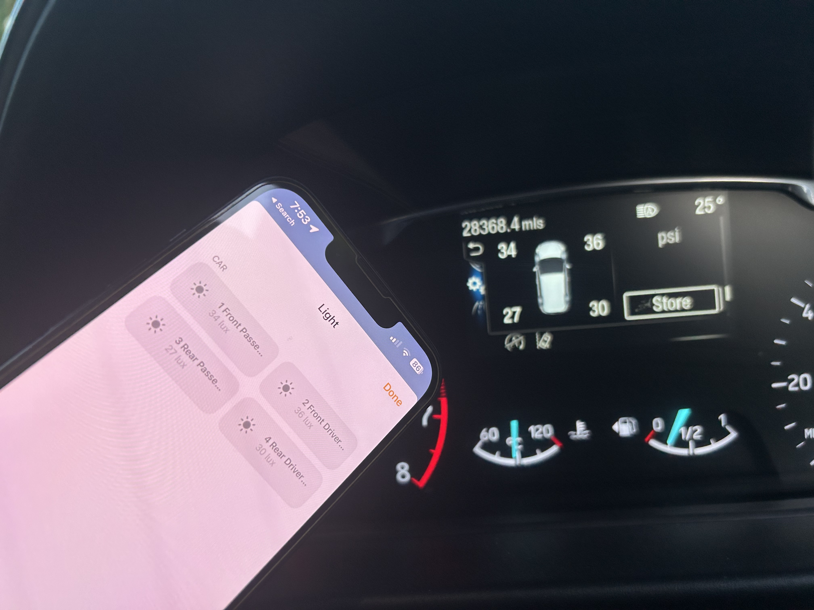

# Simple TMPS Monitor

<p align="center">
  
</p>

This project uses a Raspberry Pi to monitor a car's tyre pressures. The Raspberry Pi uses the rtl_433 tool to decode the TPMS signals and send the data to a Python script. The Python script then sends a UDP packet to Homebridge, which displays the tyre pressure as a light value in the Home app.

This code is provided as a starting point for other projects. Feel free to modify the code to meet your specific needs.

## To run

```
rtl_433 -F json | python3 TMPS_Monitor.py
```
